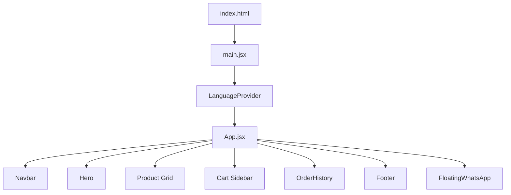

# 🏗️ Comprehensive Developer Guide
## Pandit Ji Paneer Wale - E-commerce Website

> **Complete technical documentation for developers, maintainers, and contributors.**

---

## 📋 Table of Contents

1. [Project Overview](#project-overview)
2. [Technology Stack](#technology-stack)
3. [Architecture & File Structure](#architecture--file-structure)
4. [Getting Started](#getting-started)
5. [Understanding the Codebase](#understanding-the-codebase)
6. [Making Changes](#making-changes)
7. [Adding New Features](#adding-new-features)
8. [AI Image Sync Tool](#ai-image-sync-tool)
9. [Internationalization (i18n)](#internationalization-i18n)
10. [Styling & Theming](#styling--theming)
11. [Testing & Verification](#testing--verification)
12. [Deployment Workflow](#deployment-workflow)
13. [Troubleshooting](#troubleshooting)
14. [Best Practices](#best-practices)

---

## Project Overview

**Pandit Ji Paneer Wale** is a modern, responsive e-commerce website for an Indian grocery store based in Abu Dhabi, UAE. The site enables customers to browse products, add items to cart, and checkout via WhatsApp.

### Key Features

| Feature | Description |
|---------|-------------|
| **Product Catalog** | 150+ products across 10 categories (Milk Products, Spices, Amul, etc.) |
| **Fuzzy Search** | Typo-tolerant search with Levenshtein distance matching |
| **Shopping Cart** | Persistent cart with quantity limits (50 items, 50kg, 50L) |
| **WhatsApp Checkout** | Orders sent directly to WhatsApp with delivery time slots |
| **Order History** | Track past orders with reorder functionality |
| **Dark Mode** | System-aware dark/light theme toggle |
| **Bilingual** | English & Arabic with RTL support |
| **AI Image Sync** | Gemini-powered product image identification & optimization |

### Live Site

- **URL**: [panditjipaneerwale.me](https://panditjipaneerwale.me)
- **Repository**: GitHub Pages deployment

---

## Technology Stack

### Core Technologies

```
┌─────────────────────────────────────────────────────────────────┐
│                        Frontend Stack                            │
├─────────────────────────────────────────────────────────────────┤
│  React 18.2      │  Component-based UI framework                 │
│  Vite 5.1        │  Fast build tool & dev server                 │
│  Tailwind CSS 3.4│  Utility-first CSS framework                  │
│  Framer Motion   │  Animation library                            │
│  Lucide React    │  Icon library                                 │
└─────────────────────────────────────────────────────────────────┘
```

### Dependencies

| Package | Version | Purpose |
|---------|---------|---------|
| `react` | ^18.2.0 | UI Framework |
| `react-dom` | ^18.2.0 | React DOM renderer |
| `framer-motion` | ^11.0.8 | Animations & transitions |
| `lucide-react` | ^0.344.0 | Icons |
| `@google/generative-ai` | ^0.21.0 | Gemini AI for image processing |
| `sharp` | ^0.34.5 | Image processing & optimization |
| `dotenv` | ^16.4.5 | Environment variables |

### Dev Dependencies

- **Vite** - Dev server & bundler
- **ESLint** - Code linting
- **PostCSS** + **Autoprefixer** - CSS processing
- **Tailwind CSS** - Styling

---

## Architecture & File Structure

```
panditjipaneerwale.me-source/
│
├── 📄 Core Configuration
│   ├── package.json          # Dependencies & scripts
│   ├── vite.config.js        # Vite configuration
│   ├── tailwind.config.js    # Tailwind theme & colors
│   ├── postcss.config.js     # PostCSS plugins
│   ├── .env                  # Environment variables (GITIGNORED)
│   └── .env.example          # Environment template
│
├── 📂 src/                   # Source code
│   ├── main.jsx              # React entry point
│   ├── App.jsx               # Main application component (513 lines)
│   ├── index.css             # Global Tailwind styles
│   │
│   ├── 📂 components/        # React components
│   │   ├── Navbar.jsx        # Navigation & search
│   │   ├── Hero.jsx          # Landing hero section
│   │   ├── ProductCard.jsx   # Product display card
│   │   ├── Cart.jsx          # Shopping cart sidebar
│   │   ├── OrderHistory.jsx  # Past orders viewer
│   │   ├── Footer.jsx        # Site footer
│   │   ├── FloatingWhatsApp  # WhatsApp button
│   │   ├── DealOfTheDay.jsx  # Promotional section
│   │   └── SkeletonCard.jsx  # Loading placeholder
│   │
│   ├── 📂 context/           # React Context
│   │   └── LanguageContext.jsx  # i18n provider
│   │
│   └── 📂 data/              # Static data
│       ├── products.js       # Product catalog (1301 lines, 150+ products)
│       └── translations.js   # EN/AR translations
│
├── 📂 public/                # Static assets
│   └── images/
│       └── products/         # Product images (WebP format)
│
├── 📂 pending_images/        # AI image processing queue
│   └── needs_review/         # Low-confidence matches
│
├── 📂 dist/                  # Built output (gitignored on source)
│
├── 📂 .github/workflows/     # CI/CD
│   └── deploy.yml            # GitHub Actions deployment
│
├── 🛠️ Tools
│   └── sync_by_name.js       # AI Image Sync (Gemini-powered)
│
└── 📝 Documentation
    ├── README.md
    ├── DEVELOPMENT_GUIDE.md
    ├── IMAGE_SYNC_GUIDE.md
    └── maintenance guide.md
```

---

## Getting Started

### Prerequisites

- **Node.js 20+** (LTS recommended)
- **npm** or **yarn**
- **Git**
- **Gemini API Key** (for AI image sync - optional)

### Initial Setup

```powershell
# 1. Clone the repository
git clone https://github.com/[username]/panditjipaneerwale.me.git
cd panditjipaneerwale.me

# 2. Switch to source branch (CRITICAL!)
git checkout source

# 3. Install dependencies
npm install

# 4. Create environment file (optional, for AI features)
cp .env.example .env
# Edit .env and add your GEMINI_API_KEY

# 5. Start development server
npm run dev
```

### Available Scripts

| Command | Description |
|---------|-------------|
| `npm run dev` | Start dev server at `http://localhost:5173` |
| `npm run build` | Build for production to `./dist` |
| `npm run preview` | Preview production build locally |
| `npm run lint` | Run ESLint to check code quality |
| `npm run images:sync` | Process pending images with AI |

---

## Understanding the Codebase

### Entry Point Flow



### State Management

The app uses **React's built-in state** with `useState` and `useEffect`. No external state library.

| State | Location | Persistence |
|-------|----------|-------------|
| Cart Items | `App.jsx` | localStorage (`cart`) |
| Products | `App.jsx` | localStorage (`products_custom`) |
| Language | `LanguageContext` | localStorage (`language`) |
| Dark Mode | `App.jsx` | System preference |
| Order History | `OrderHistory.jsx` | localStorage (`orderHistory`) |

### Key Components Explained

#### `App.jsx` - The Brain

The main component (513 lines) handles:

- **Cart Logic**: Add, remove, update quantities with limits
- **Fuzzy Search**: Typo-tolerant product search with Levenshtein distance
- **Category Filtering**: Sidebar & mobile category navigation
- **Dark Mode**: Toggle with system preference detection
- **Product Filtering**: Combined search + category filtering with relevance sorting

```jsx
// Key functions in App.jsx:
addToCart(product)      // Add item with limit checks
removeFromCart(id)      // Remove item by ID
updateQuantity(id, qty) // Update with limit checks
fuzzyMatch(text, query) // Search with typo tolerance
checkLimits(items)      // Validate cart constraints
```

#### `ProductCard.jsx` - Product Display

- Displays product image, name, price, description
- Skeleton loading while images load
- Fallback image for missing/broken images
- Hover animations via Tailwind

#### `Cart.jsx` - Shopping Cart

- Slide-in sidebar with cart contents
- Quantity controls with +/- buttons
- Delivery time slot selection
- WhatsApp checkout integration
- Order saved to history on checkout

#### `LanguageContext.jsx` - Internationalization

Provides translations and RTL support:

```jsx
const { t, language, toggleLanguage, isRTL } = useLanguage();

// Usage:
<h1>{t('heroTitle')}</h1>  // Outputs translated text
```

---

## Making Changes

### Modifying Products

Products are defined in `src/data/products.js`:

```javascript
// Product structure:
{
  id: 3,                          // Unique ID
  name: "Fresh Paneer (500g)",    // Display name with size
  category: "Milk Products",      // Must match category list
  price: 15,                      // Price in AED
  image: "images/products/product-3.webp",  // Image path
  description: "Soft and fresh paneer..."   // Short description
}
```

**To add a new product:**

1. Open `src/data/products.js`
2. Add a new object with a unique `id`
3. Ensure `category` matches one in the `categories` array
4. Add product image via AI sync or manually to `public/images/products/`

**To add a new category:**

1. Add category name to `categories` array in `products.js`
2. Add translations in `translations.js` for EN and AR

### Modifying Translations

Edit `src/data/translations.js`:

```javascript
export const translations = {
    en: {
        heroTitle: "Fresh Paneer Delivered to Your Doorstep",
        // ... add more keys
    },
    ar: {
        heroTitle: "بانير طازج يصلك حتى باب منزلك",
        // ... matching Arabic translations
    }
};
```

### Modifying Brand Colors

Edit `tailwind.config.js`:

```javascript
colors: {
  brand: {
    orange: '#FF8C00',     // Primary brand color
    light: '#FFF5E6',      // Light background
    dark: '#E67E00',       // Darker orange
    darker: '#1a1a1a',     // Dark mode background
    card: '#2d2d2d',       // Dark mode card
  }
}
```

### Modifying Contact Information

Update in multiple files:

1. **Footer contact**: `src/components/Footer.jsx`
2. **WhatsApp number**: `src/components/Cart.jsx` (line ~62)
3. **Contact section**: `src/App.jsx` (lines 466-480)

---

## Adding New Features

### Adding a New Component

1. Create file in `src/components/NewComponent.jsx`
2. Follow existing component structure:

```jsx
import React from 'react';
import { useLanguage } from '../context/LanguageContext';

const NewComponent = ({ prop1, prop2 }) => {
  const { t } = useLanguage();
  
  return (
    <div className="...tailwind classes...">
      {/* Component JSX */}
    </div>
  );
};

export default NewComponent;
```

3. Import and use in `App.jsx`

### Adding New Pages/Sections

Since this is a single-page app, add new sections to `App.jsx`:

```jsx
{/* Add after existing sections */}
<section id="new-section" className="py-20 bg-white dark:bg-brand-card">
  <div className="container mx-auto px-4">
    <h2>{t('newSectionTitle')}</h2>
    {/* Section content */}
  </div>
</section>
```

Add navigation link in `Navbar.jsx`.

---

## AI Image Sync Tool

### Overview

The AI Image Sync tool (`sync_by_name.js`) uses **Google Gemini** to:

1. Identify products from photos
2. Match them to the product database
3. Smart-crop to focus on the product
4. Convert to optimized WebP (800x800)
5. Update `products.js` automatically

### Setup

1. Get a Gemini API key from [Google AI Studio](https://makersuite.google.com/app/apikey)
2. Add to `.env`:

```env
GEMINI_API_KEY=your_api_key_here
GEMINI_MODEL=gemini-2.0-flash-exp
GEMINI_DELAY_MS=2000
```

### Usage

```powershell
# 1. Drop images into pending_images/
# 2. Run the sync:
npm run images:sync
```

### How It Works

```
┌─────────────────┐    ┌──────────────┐    ┌─────────────────┐
│ Drop image in   │───►│ Gemini AI    │───►│ Confidence ≥80% │
│ pending_images/ │    │ identifies   │    │                 │
└─────────────────┘    └──────────────┘    └────────┬────────┘
                                                    │
                           ┌────────────────────────┼────────────────────┐
                           │                        │                     │
                           ▼                        ▼                     ▼
                   ┌───────────────┐      ┌─────────────────┐    ┌───────────────┐
                   │ Move to       │      │ Process & save  │    │ Update        │
                   │ needs_review/ │      │ to products/    │    │ products.js   │
                   └───────────────┘      └─────────────────┘    └───────────────┘
```

### Folder Structure

```
pending_images/           ← Drop images here
├── needs_review/         ← Low-confidence matches (manual review)
public/images/products/   ← Final processed images
```

---

## Internationalization (i18n)

### Supported Languages

| Code | Language | Direction |
|------|----------|-----------|
| `en` | English | LTR |
| `ar` | Arabic | RTL |

### Using Translations

```jsx
import { useLanguage } from '../context/LanguageContext';

function MyComponent() {
  const { t, language, toggleLanguage, isRTL } = useLanguage();
  
  return (
    <div dir={isRTL ? 'rtl' : 'ltr'}>
      <p>{t('someKey')}</p>
      <button onClick={toggleLanguage}>
        {language === 'en' ? 'عربي' : 'English'}
      </button>
    </div>
  );
}
```

### Adding New Translations

1. Add key to both `en` and `ar` objects in `translations.js`
2. Use `{t('keyName')}` in components

---

## Styling & Theming

### Tailwind CSS Classes

The project uses Tailwind CSS v3.4 with custom configuration:

```javascript
// Custom font
fontFamily: {
  sans: ['Outfit', 'sans-serif'],
}

// Dark mode (class-based)
darkMode: 'class'
```

### Dark Mode

Dark mode is toggled via the `isDarkMode` state in `App.jsx`:

```jsx
// Toggle function
const toggleTheme = React.useCallback(() => setIsDarkMode(prev => !prev), []);

// Applied to document
useEffect(() => {
  if (isDarkMode) {
    document.documentElement.classList.add('dark');
  } else {
    document.documentElement.classList.remove('dark');
  }
}, [isDarkMode]);
```

Use `dark:` prefix for dark mode styles:

```jsx
<div className="bg-white dark:bg-brand-card text-gray-800 dark:text-white">
```

### Animation Patterns

Using Framer Motion:

```jsx
import { motion, AnimatePresence } from 'framer-motion';

// Hover animation
<motion.div whileHover={{ scale: 1.1 }} />

// Mount/unmount animation
<AnimatePresence>
  {isVisible && (
    <motion.div
      initial={{ opacity: 0 }}
      animate={{ opacity: 1 }}
      exit={{ opacity: 0 }}
    />
  )}
</AnimatePresence>
```

---

## Testing & Verification

### Manual Testing Checklist

Since there are no automated tests, use this checklist:

#### Core Functionality

- [ ] Products load and display correctly
- [ ] Search works with exact and fuzzy matches
- [ ] Category filtering works (sidebar & mobile)
- [ ] Add to cart works with animation
- [ ] Cart updates quantity correctly
- [ ] Cart limits work (50 items/50kg/50L)
- [ ] WhatsApp checkout generates correct message
- [ ] Order saves to history after checkout
- [ ] Reorder from history works

#### UI/UX

- [ ] Dark mode toggles correctly
- [ ] Language toggles (EN ↔ AR)
- [ ] RTL layout correct in Arabic
- [ ] Mobile responsive design
- [ ] All images load (check console for 404s)
- [ ] Animations smooth on mobile

#### Browser Testing

Test on:
- [ ] Chrome (Desktop & Mobile)
- [ ] Firefox
- [ ] Safari (if available)
- [ ] Edge

### Running ESLint

```powershell
npm run lint
```

### Build Verification

```powershell
# Build and preview
npm run build
npm run preview

# Check dist folder created
ls dist/
```

---

## Deployment Workflow

> ⚠️ **CRITICAL**: This project uses a **two-branch system**. Never edit `main` directly!

### Branch Strategy

| Branch | Purpose | Editing |
|--------|---------|---------|
| `source` | Development code | ✅ EDIT HERE |
| `main` | Live website (built files) | ⛔ AUTO-GENERATED |

### Deployment Steps

#### Option 1: Ask AI (Recommended)

> "I have made changes on the source branch. Please build and deploy the project to the main branch."

#### Option 2: Manual Deployment

```powershell
# 1. Ensure you're on source branch
git checkout source

# 2. Build the project
npm run build

# 3. Commit your source changes first
git add .
git commit -m "Your change description"
git push origin source

# 4. Deploy to main
git checkout main

# 5. Clean old files (PowerShell)
Get-ChildItem -Path . -Exclude ".git", "dist", "README.md", "DEVELOPMENT_GUIDE.md" | Remove-Item -Recurse -Force

# 6. Move build files
Move-Item -Path .\dist\* -Destination . -Force
Remove-Item -Path .\dist -Force

# 7. Restore CNAME
Set-Content -Path .\CNAME -Value "panditjipaneerwale.me"

# 8. Push to main
git add .
git commit -m "Deploy update"
git push origin main

# 9. Return to source immediately!
git checkout source
```

### GitHub Actions

The repository includes `.github/workflows/deploy.yml` for automated deployment:

- Triggers on push to `main` branch
- Builds with Node 20
- Deploys to GitHub Pages

---

## Troubleshooting

### Common Issues

| Issue | Cause | Solution |
|-------|-------|----------|
| "vite: command not found" | Missing dependencies | Run `npm install` |
| Files missing after deployment | On wrong branch | Run `git checkout source` |
| Site shows old content | Browser cache | Open in Incognito or clear cache |
| 404 on live site | Missing CNAME | Ensure CNAME file exists on `main` |
| Images not showing | Broken path | Check `public/images/products/` |
| EBUSY error on Windows | File locked | Wait and retry, or restart VS Code |

### Debugging Tips

1. **Check console**: Open DevTools (F12) → Console tab
2. **Check network**: DevTools → Network tab for failed requests
3. **Check localStorage**: DevTools → Application → Local Storage
4. **Check build**: Run `npm run build` and check for errors

### Git Recovery

```powershell
# Reset local changes
git checkout -- .

# Switch branches safely
git stash
git checkout source
git stash pop

# Force sync with remote
git fetch origin
git reset --hard origin/source
```

---

## Best Practices

### Code Style

- Use **functional components** with hooks
- Use **destructuring** for props
- Use **useCallback/useMemo** for expensive computations
- Follow existing naming conventions
- Add comments for complex logic

### Performance

- Use **lazy loading** for images (already implemented via skeleton)
- Memoize expensive computations with `useMemo`
- Avoid inline function definitions in JSX
- Keep component files under 500 lines

### Git Workflow

1. Always work on `source` branch
2. Make small, focused commits
3. Write descriptive commit messages
4. Push to source regularly
5. Deploy only when ready for public

### Image Guidelines

- Use **WebP** format for best compression
- Target **800x800 pixels** for product images
- Use **white or transparent** backgrounds
- Compress images before adding manually
- Use AI sync tool when possible

---

## Quick Reference

### NPM Scripts

```powershell
npm run dev          # Start development server
npm run build        # Build for production
npm run preview      # Preview production build
npm run lint         # Check code quality
npm run images:sync  # Process images with AI
```

### Key Files to Edit

| To change... | Edit this file |
|--------------|----------------|
| Products | `src/data/products.js` |
| Translations | `src/data/translations.js` |
| Colors/Theme | `tailwind.config.js` |
| Contact info | `src/App.jsx`, `src/components/Footer.jsx` |
| Navigation | `src/components/Navbar.jsx` |
| WhatsApp number | `src/components/Cart.jsx` |

### Environment Variables

```env
GEMINI_API_KEY=      # Your Gemini API key
GEMINI_MODEL=        # Model to use (default: gemini-2.0-flash-exp)
GEMINI_DELAY_MS=     # Rate limit delay (default: 2000)
```

---

## Need Help?

1. **Check existing documentation** in the project root
2. **Search codebase** for similar implementations
3. **Ask AI assistant** with project context (see DEVELOPMENT_GUIDE.md)
4. **Check Git history** for recent changes

---

*Last updated: December 2024*
